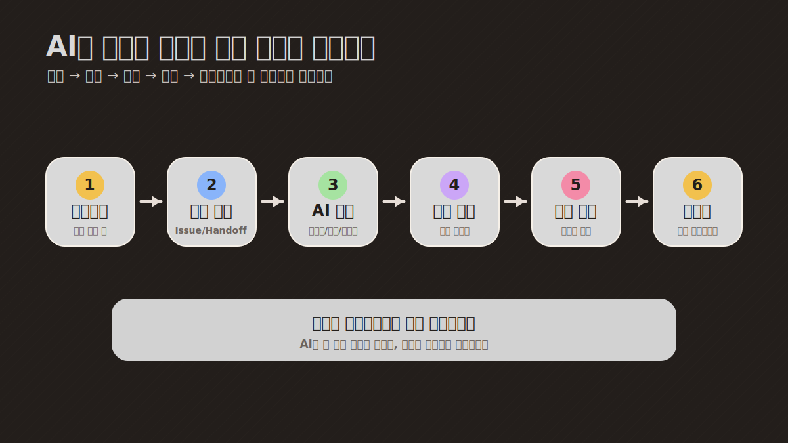
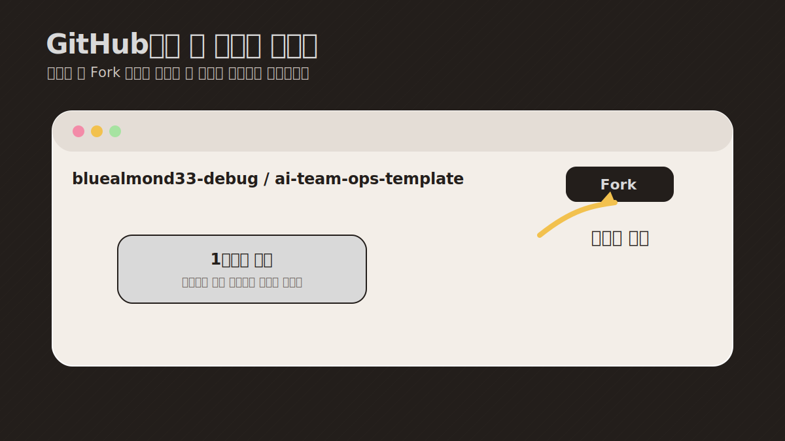
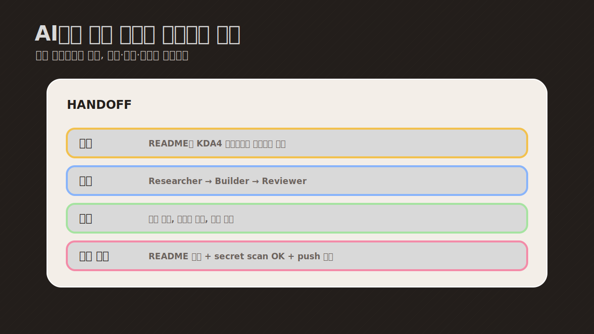
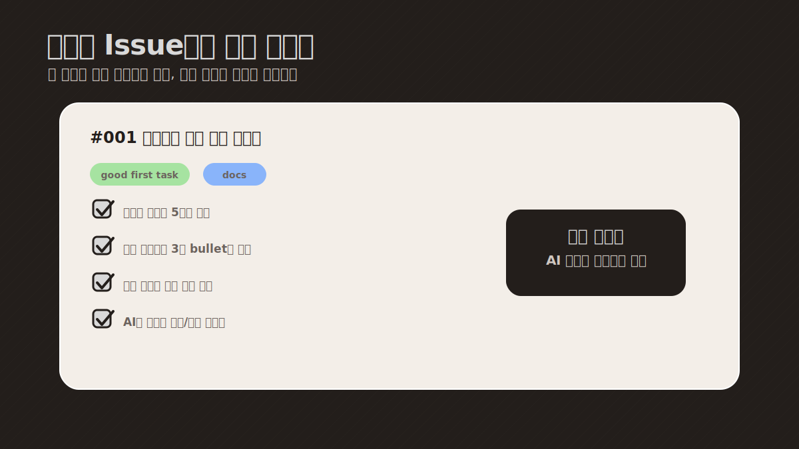
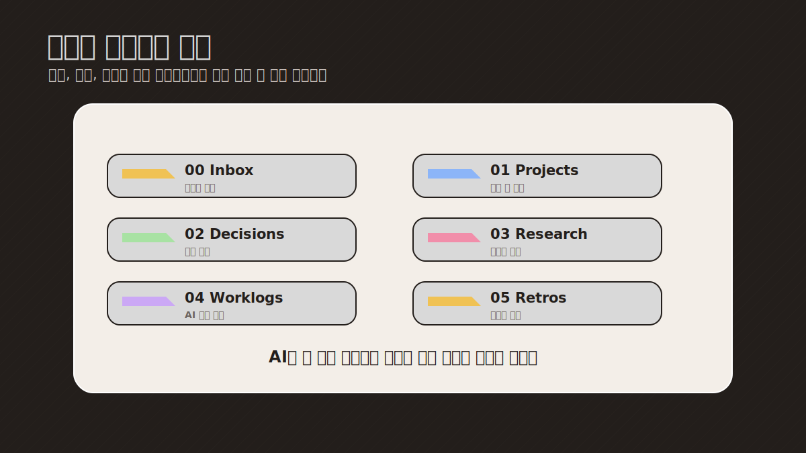

# AI Team Ops Template

AI를 혼자 쓰는 챗봇이 아니라, **작은 팀처럼 운영하기 위한 템플릿**입니다.

개발자가 아니어도 괜찮습니다. 이 저장소는 코드를 배우라는 자료가 아니라, AI를 더 체계적으로 쓰고 싶은 사람이 그대로 복사해서 자기 프로젝트에 맞게 바꿔 쓰는 샘플입니다.

> 핵심: 좋은 운영 방식을 숨기지 말고, fork해서 따라 할 수 있게 공개하기

## 이런 분께 추천합니다

- AI를 자주 쓰지만 결과물이 여기저기 흩어지는 분
- 팀플, 사이드프로젝트, 포트폴리오를 AI와 같이 운영하고 싶은 분
- 매번 프롬프트를 새로 쓰는 대신, 검증 가능한 작업 흐름을 만들고 싶은 분
- GitHub를 잘 몰라도 AI 협업 방식을 배워보고 싶은 분

## 이 템플릿으로 할 수 있는 것

- AI에게 역할을 나눠 맡기기
- 작업 요청을 GitHub Issue처럼 정리하기
- AI가 한 일을 handoff 문서로 넘겨받기
- 결정, 회고, 학습 내용을 노트처럼 쌓기
- 결과물을 PR/리뷰 흐름으로 검증하기

## 전체 흐름



쉽게 말하면, AI에게 그냥 “해줘”라고 말하는 대신 아래처럼 운영합니다.

1. 어떤 일을 할지 짧게 정한다
2. 어떤 AI 역할이 맡을지 정한다
3. 결과와 근거를 문서로 남긴다
4. 사람이 마지막에 확인한다
5. 좋은 방식은 다음 프로젝트에서 다시 쓴다

## 먼저 볼 파일 5개

- [QUICKSTART.md](QUICKSTART.md): 처음 시작하는 방법
- [docs/kda4-workshop.md](docs/kda4-workshop.md): KDA4 실습용 안내
- [examples/demo-agency/team.yaml](examples/demo-agency/team.yaml): AI 팀 역할 예시
- [templates/handoff.md](templates/handoff.md): AI에게 일을 넘기고 받는 양식
- [examples/sample-obsidian-vault/README.md](examples/sample-obsidian-vault/README.md): 기록 저장소 예시

## 비개발자용 시작 방법

### 1. GitHub 계정 만들기

GitHub는 개발자만 쓰는 곳이 아니라, 프로젝트 파일과 작업 기록을 보관하는 공간이라고 생각하면 됩니다.

### 2. 이 저장소를 Fork하기



오른쪽 위 **Fork** 버튼을 누르면 내 계정에 복사본이 생깁니다.

### 3. 예시 파일부터 바꾸기



처음부터 전부 이해하려 하지 않아도 됩니다. 아래 3개만 바꿔보면 됩니다.

- `examples/demo-agency/team.yaml`: 내 AI 팀 이름과 역할
- `templates/handoff.md`: AI에게 일을 맡기는 양식
- `examples/sample-issues/001-create-project-brief.md`: 첫 작업 예시

### 4. 내 프로젝트에 적용하기

예시 이름을 내 프로젝트 이름으로 바꾸고, AI에게 실제 작업을 하나 맡겨보세요.

예시:

- 취업 포트폴리오 만들기
- 금융 데이터 분석 프로젝트 정리하기
- 팀플 리서치 역할 나누기
- 매일 공부 기록과 회고 남기기

## 개발자용 빠른 실행

```sh
git clone https://github.com/bluealmond33-debug/ai-team-ops-template.git
cd ai-team-ops-template
cp .env.example .env
./scripts/setup-demo.sh
./scripts/validate-config.sh
```

실제 API 키 없이도 demo mode로 구조를 볼 수 있습니다.

## 폴더 구조





```text
docs/        설명과 실습 문서
examples/    가짜 팀, 이슈, 노트, 채널 예시
templates/   역할, handoff, issue, 리뷰, 브리프 양식
scripts/     데모 설정과 검증 도구
plugins/     공개용 플러그인 예시 자리
```

## 안전 원칙

공개 저장소에는 아래 정보를 절대 넣지 않습니다.

- 실제 API 키와 토큰
- 실제 채팅방 ID
- 개인 메모와 내부 전략
- 고객 정보, 회사 내부 정보, 로그 원문

이 저장소에는 모두 가짜 예시 데이터만 들어 있습니다.

## 이미지 자산

README에 들어간 이미지는 모두 설명용 가짜 화면입니다. 실제 채팅방, 개인 메모, 내부 프로젝트 정보는 포함하지 않았습니다.

- [AI 팀 운영 흐름](docs/assets/ai-team-flow.svg)
- [GitHub Fork 안내](docs/assets/github-fork-guide.svg)
- [handoff 문서 예시](docs/assets/handoff-example.svg)
- [Issue 예시](docs/assets/issue-example.svg)
- [Obsidian식 기록 폴더 예시](docs/assets/obsidian-vault-example.svg)

이미지 목록과 제작 기준은 [docs/visual-assets-needed.md](docs/visual-assets-needed.md)에 정리했습니다.

## 한 줄로 설명하면

AI를 더 잘 쓰고 싶은 사람이, 작은 AI 팀 운영 방식을 그대로 복사해서 자기 프로젝트에 적용할 수 있게 만든 공개 템플릿입니다.

## License

- Code: MIT
- Docs/templates: 자유롭게 복사하고 수정해서 사용해도 됩니다.
